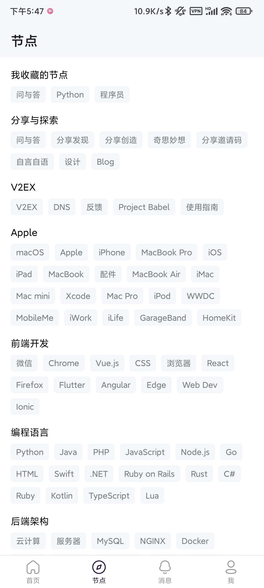
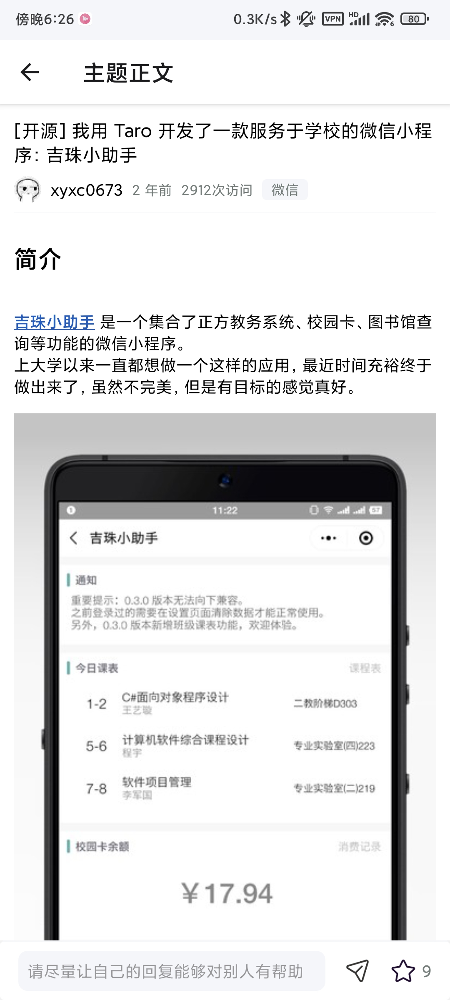

<p align="center">
  
</p>

# V2EX Plus(V2EX+)
V2EX Plus，亦简称为 V2EX+，是使用 React Native 实现的又一款 [V2EX](https://www.v2ex.com/) 社区的客户端。

## 预览
<p style="margin-bottom: 20px">
  
  
  
</p>

<p style="margin-bottom:: 20px">
  
  
  
</p>

<p style="margin-bottom:: 20px">
  
  
  

</p>

## 功能
参考了市面上已有的 App，结合个人的需求，目前已开发的功能点如下：
- 对于帖子的阅读、回复、收藏、已读历史
- 对于回复的点赞、对话查看
- 对于用户的资料查看、关注管理
- 对于节点的浏览、主题列表、关注管理
- 对于使用者的登录、签到、通知、余额

## 技术
- react-native
- react-navigation
- reduxjs/toolkit
- react-native-render-html
- axios
- cheerio

路由导航方面，使用了 React Navgiation，并且同时使用了 Stack Navigator 和 Tabbar Navigator 和 Topbar Navigator。  
数据存储方面，使用了 Redux Toolkit 简化 Redux 的使用，异步使用了 Redux Thunk，并且使用 Redux Persist 作持久化存储。  
数据获取方面，一是直接使用了 V2EX 的 API，二是使用 Axios 和 Cheerio 模拟正常浏览并且解析网页。

## 开发
> 由于使用了 reanimated 2，开启了一些新的功能，原本用于 React Native 远程调试的 Remote Debug 无法使用。  
> 作为替代，可以使用 Facebook 推出的 [Flipper](https://fbflipper.com/) 来调试应用。

配置好 React Native 开发环境和 Android 运行环境。
```bash
git clone https://github.com/xyxc0673/v2ex-plus
cd v2ex-plus
yarn
yarn start
yarn bundle-android
```

## 参与
目前只在 Android 端调试过，所以无法确保 iOS 端正常使用。  
另外在许多地方的实现上比较笨拙，在性能表现上也有明显的问题。  
因此非常欢迎任何感兴趣的开发者参与到本项目的开发和迭代中。